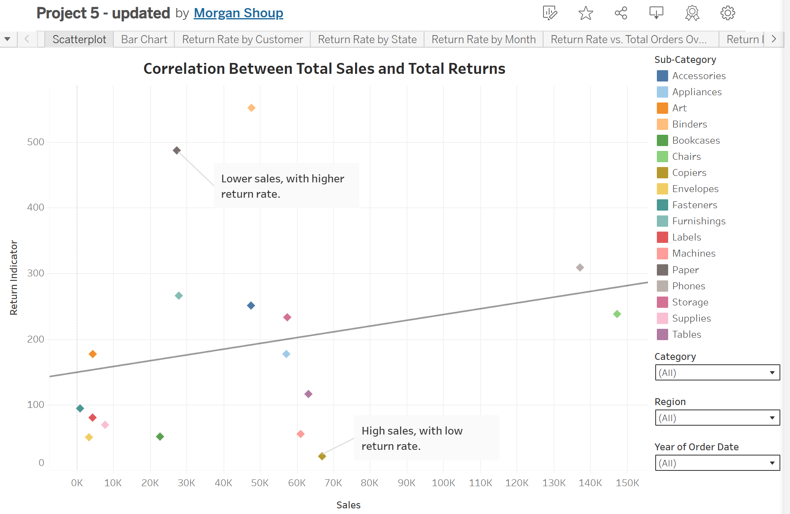
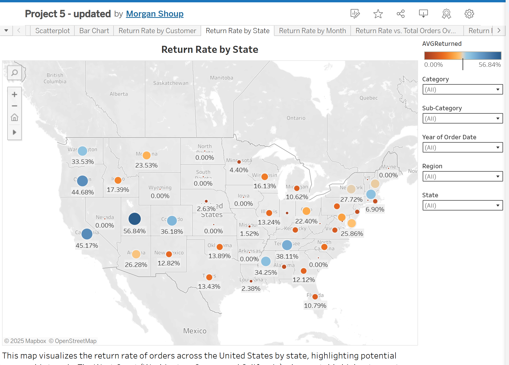
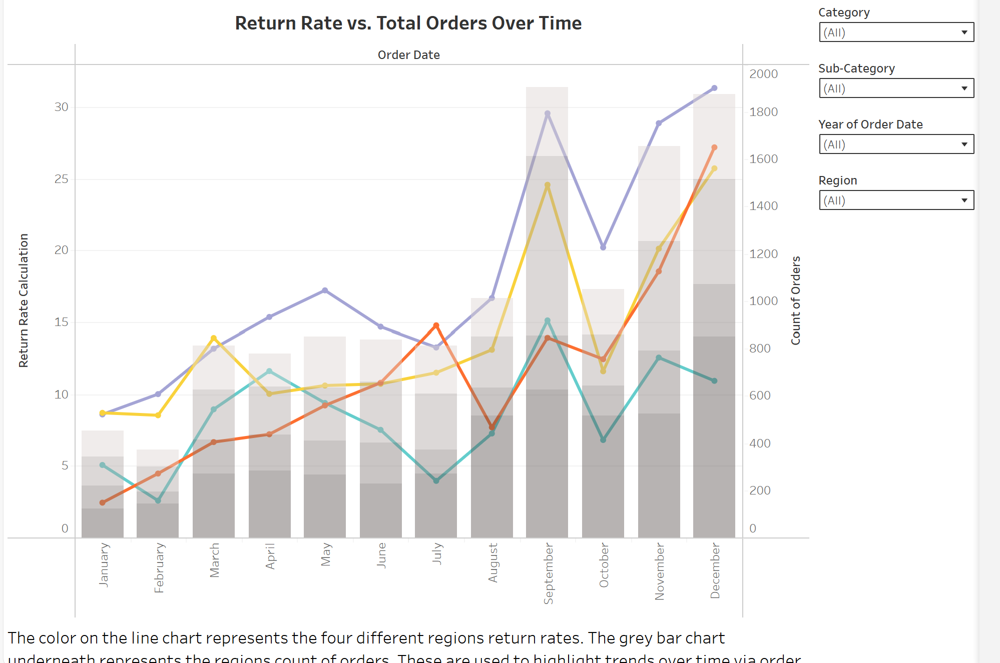

## Superstore-Storytelling-Project-Tableau

## Overview
This data storytelling project explores key return patterns across product categories, states, and time in a fictional superstore dataset. The analysis aims to identify trends in return rates and their correlation with sales to support better inventory and customer experience strategies.

## Tools Used
Tableau
Excel (for data preparation)

## Key Features / Analysis
Return Rate Analysis by State: A filled map visual highlights geographical return patterns and states with higher-than-average return rates.

Sales vs. Returns Scatterplot: Displays correlation between total sales and total return volume across subcategories.

Return Rate Over Time: A dual-axis line and bar chart explores monthly return rates and total orders across four U.S. regions.

Customer & Category Return Insights: Additional views highlight customer-level return behavior and sub-category trends.

## Project Goals
Identify product subcategories with high return rates
Highlight regions and states with frequent returns
Correlate return behavior with total sales and customer data
Surface business risks related to inventory and product satisfaction
Propose recommendations to reduce return-related loss

## Screenshots
1. Sales vs. Return Rate Correlation

2. Return Rate by U.S. State

3. Monthly Return Trends by Region

## Status
Completed – [March 2025]

## Author
Morgan Shoup

